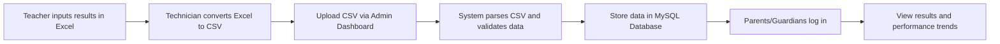

📚 Abuhureira Academy Results Issuing System

A secure, web-based academic results platform designed specifically for **Abuhureira Academy**. This system enables efficient uploading, storage, and viewing of student exam results by administrators, teachers, and parents. It supports CSV-based result uploads, detailed performance comparisons across terms, and a role-based access control system to protect sensitive student data.

---

## Table of Contents

* [Project Overview](#project-overview)
* [Features](#features)
* [Project Structure](#project-structure)
* [Installation & Setup](#installation--setup)
* [Usage](#usage)
* [Authentication & Authorization](#authentication--authorization)
* [Data Flow](#data-flow)
* [Security Considerations](#security-considerations)
* [Technology Stack](#technology-stack)
* [Contributing](#contributing)
* [Authors & Contact](#authors--contact)
* [License](#license)

---

## Project Overview

The **Abuhureira Academy Results Issuing System** is a web application developed to automate and secure the process of distributing academic results. Traditionally, exam results were manually managed, prone to delays and errors. This platform digitizes the workflow, allowing exam results from Excel sheets to be converted into CSV format and uploaded by technicians, parsed, and stored in a database. Parents and guardians can then securely log in to view their child’s results and monitor performance trends over multiple terms.

This system empowers the academy’s staff with tools to efficiently manage student academic data while maintaining high security and data integrity standards.

---

## Features

* **CSV Upload Support**: Technicians upload exam results via CSV files converted from Excel sheets.
* **Role-Based Access Control (RBAC)**: Separate dashboards and privileges for administrators, staff, and parents.
* **Performance Visualization**: Parents can compare exam results across different terms to track student progress.
* **Secure Authentication**: Robust login system with PHP sessions to protect user accounts.
* **Responsive Design**: Mobile-friendly interface accessible from smartphones, tablets, and desktops.
* **Error Handling & Logging**: Includes error testing environments and logging mechanisms to track issues.
* **Multi-layered Styling**: Modular CSS folders for easy customization and maintenance.
* **Scalable Architecture**: Organized folder structure to support future enhancements and additional modules.

---

## Project Structure

| Folder/File                    | Description                                                             |
| ------------------------------ | ----------------------------------------------------------------------- |
| `.htaccess`                    | Apache configuration file for URL rewriting and security rules.         |
| `about/`                       | Information and FAQ pages about the system or academy.                  |
| `admin_dashboard/`             | Admin panel for uploading results, managing users, and viewing reports. |
| `admin_login/`                 | Authentication module for admin users.                                  |
| `auth/`                        | Core authentication and session management scripts.                     |
| `authors/`                     | Developer credits and contact information.                              |
| `cache/`                       | Temporary storage for cached data to improve performance.               |
| `config/`                      | Configuration files (database, site settings, constants).               |
| `contact/`                     | Contact form and related backend handlers.                              |
| `csv_upload/`                  | CSV upload interface and processing scripts.                            |
| `error_test/`                  | Environment for testing error handling and debugging.                   |
| `home/`                        | Dashboard/homepage for logged-in users (parents, staff).                |
| `index.php`                    | Main landing page for the site.                                         |
| `index1.php`                   | Alternate or legacy homepage.                                           |
| `logout/`                      | Session termination and logout handling.                                |
| `README.md`                    | Project documentation file.                                             |
| `results/`                     | Pages showing student results and performance charts.                   |
| `script/`                      | Custom JavaScript files used site-wide.                                 |
| `service/`                     | Backend service APIs and processing logic.                              |
| `style/`, `style1/`, `styles/` | CSS stylesheets for different parts of the site.                        |

---

## Installation & Setup

### Requirements

* Apache Web Server with PHP 7.4 or higher
* MySQL 5.7 or higher
* PHP Extensions: mysqli, session, fileinfo, mbstring
* Composer (optional, if dependencies are managed)
* Access to upload CSV files (via admin dashboard)

### Step-by-Step Setup

1. **Clone the Repository**

   ```bash
   git clone https://github.com/yourusername/abuhureira-results-system.git
   cd abuhureira-results-system
   ```

2. **Configure Database**

   * Create a new MySQL database (e.g., `abuhureira_results`).
   * Import the provided SQL schema (if available) or run migration scripts.
   * Update the database credentials in `config/db.php` or equivalent config file.

3. **Configure Apache**

   * Ensure `.htaccess` support is enabled (`AllowOverride All`).
   * Point your virtual host document root to the project directory.

4. **Set Folder Permissions**

   * Make sure `cache/` and `csv_upload/` folders are writable by the webserver.

   ```bash
   chmod -R 775 cache csv_upload
   ```

5. **Access the Application**

   * Navigate to `http://yourdomain.com/index.php` or the root URL.
   * Use admin credentials to log in (default credentials should be changed immediately).

6. **Upload CSV Files**

   * Use the Admin Dashboard to upload student exam results in CSV format.

---

## Usage

### Admin/Technician Workflow

* Log in through the admin portal.
* Navigate to the CSV Upload section.
* Upload properly formatted CSV files converted from Excel exam results.
* Monitor system messages for upload success or errors.
* Manage user accounts and permissions through the dashboard.

### Parent/Guardian Workflow

* Log in with provided credentials.
* Access the results dashboard.
* View individual subject scores and compare them across terms.
* Download or print results if needed.

---

## Authentication & Authorization

* **Admin users** have full access to upload results, manage users, and configure settings.
* **Parents/Guardians** can only view their children's results.
* Sessions are managed via PHP session cookies with secure flags recommended on production.
* Passwords should be stored hashed using strong algorithms (e.g., bcrypt).
* Login attempts and session expirations are logged for security auditing.

---

## Data Flow



---

## Security Considerations

* Always use HTTPS in production to protect data in transit.
* Validate CSV uploads rigorously to prevent injection attacks or malformed data.
* Implement rate limiting on login endpoints to prevent brute force.
* Regularly update and patch server and dependencies.
* Store sensitive configuration outside of the web root if possible.
* Sanitize all user inputs and outputs.

---

## Technology Stack

| Component      | Technology/Library           |
| -------------- | ---------------------------- |
| Backend        | PHP                          |
| Frontend       | HTML5, CSS3, JavaScript      |
| Database       | MySQL                        |
| Server         | Apache HTTP Server           |
| Authentication | PHP Sessions, Custom Scripts |
| Styling        | Modular CSS                  |

---

## Contributing

We welcome contributions from the community! To contribute:

1. Fork the repository.
2. Create a feature branch (`git checkout -b feature-name`).
3. Commit your changes with clear messages.
4. Push the branch and open a pull request.

Please ensure code quality and test thoroughly before submitting.

---

## Authors & Contact

* **Lead Developer:** Abdinasir Mohamed Aden
* **Development Team:** IT Department, Abuhureira Academy

For support, issues, or inquiries:

* Email: [it.support@abuhureiraacademy.ac.ke](mailto:it.support@abuhureiraacademy.ac.ke)
* GitHub Issues: \[repository issues page]

---

## License

This project is licensed under the MIT License — see the [LICENSE](LICENSE) file for details.
